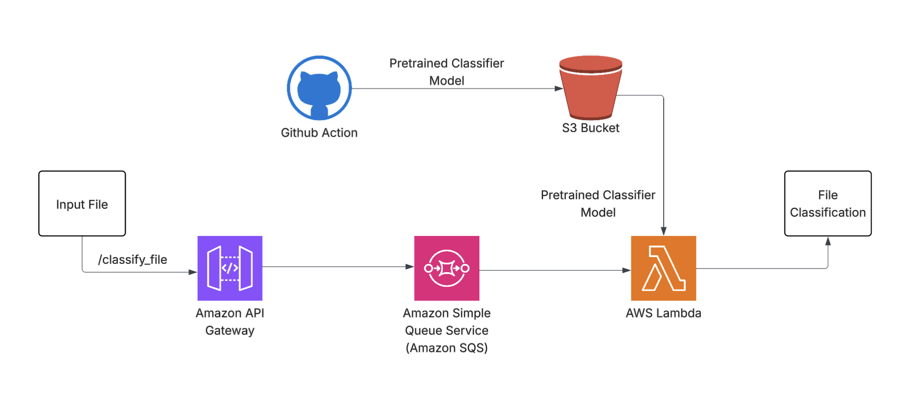

# Heron Coding Challenge - File Classifier

## Approach

1. **Generate synthetic data for different industries** (`bank_statement`, `drivers_license`, `invoice`)  
   - Using the example files already provided in the repository, I wrote functions to generate fake text data.
   - The generated text is labeled with its respective industry and saved to a CSV file (`files/processed_data/generated_text_with_labels.csv`).

2. **Train a classifier model using the synthetic data**  
   - I opted to use a BERT model from the Hugging Face library. Its ability to learn from bidirectional text made it a strong fit for this use case.

3. **Extract text from files sent to the API**  
   - Text extraction from PDFs was relatively straightforward.
   - For image files, I added preprocessing steps to convert the image to grayscale, remove background noise, and apply thresholding. This significantly improved text extraction accuracy.

4. **Classify the extracted text using the pretrained model**  
   - The text is passed to the trained classifier, which then predicts the industry the file belongs to.

## Future Improvements

- Currently, the model supports only three industries: `bank_statement`, `drivers_license`, and `invoice`. Support for additional industries can be added by training the model on synthetic data for the new category.
- Add logic to return `"unknown"` if the model's confidence falls below a defined threshold during classification.
- Configure a GitHub Action (or Jenkins, depending on memory/CPU constraints) to automate synthetic data generation, model training, and artifact storage in S3. This workflow would trigger only on merges to `main`, unless a specific flag is enabled in the pull request.
- Optimize the system for deployment (outlined below).

## Deployment

If I were to deploy this application, I would use the following architecture:

- **Amazon S3** to store the pretrained classifier model  
- **Amazon API Gateway** as the entry point to the API  
- **Amazon SQS** to decouple incoming requests  
- **AWS Lambda** to process and classify the files  

This setup would allow the system to scale efficiently while keeping infrastructure overhead low.



## Updated Instructions
1. Clone the repository:
    ```shell
    git clone <repository_url>
    cd join-the-siege
    ```
2. Install Tesseract
    - This is needed to process images
    ```shell
    brew install tesseract
    ```
3. Install dependencies:
    ```shell
    python -m venv venv
    source venv/bin/activate
    pip install -r requirements.txt
    ```
4. Generate Synthetic Data and Train the Classifier Model
    ```shell
    python src/setup.py
    ```

3. Run the Flask app:
    ```shell
    python -m src.app
    ```

4. Test the classifier using a tool like curl:
    ```shell
    curl -X POST -F 'file=@path_to_pdf.pdf' http://127.0.0.1:5000/classify_file
    ```

5. Run tests:
   ```shell
    pytest
    ```

## Overview

At Heron, we’re using AI to automate document processing workflows in financial services and beyond. Each day, we handle over 100,000 documents that need to be quickly identified and categorised before we can kick off the automations.

This repository provides a basic endpoint for classifying files by their filenames. However, the current classifier has limitations when it comes to handling poorly named files, processing larger volumes, and adapting to new industries effectively.

**Your task**: improve this classifier by adding features and optimisations to handle (1) poorly named files, (2) scaling to new industries, and (3) processing larger volumes of documents.

This is a real-world challenge that allows you to demonstrate your approach to building innovative and scalable AI solutions. We’re excited to see what you come up with! Feel free to take it in any direction you like, but we suggest:


### Part 1: Enhancing the Classifier

- What are the limitations in the current classifier that's stopping it from scaling?
- How might you extend the classifier with additional technologies, capabilities, or features?


### Part 2: Productionising the Classifier 

- How can you ensure the classifier is robust and reliable in a production environment?
- How can you deploy the classifier to make it accessible to other services and users?

We encourage you to be creative! Feel free to use any libraries, tools, services, models or frameworks of your choice

### Possible Ideas / Suggestions
- Train a classifier to categorize files based on the text content of a file
- Generate synthetic data to train the classifier on documents from different industries
- Detect file type and handle other file formats (e.g., Word, Excel)
- Set up a CI/CD pipeline for automatic testing and deployment
- Refactor the codebase to make it more maintainable and scalable

## Marking Criteria
- **Functionality**: Does the classifier work as expected?
- **Scalability**: Can the classifier scale to new industries and higher volumes?
- **Maintainability**: Is the codebase well-structured and easy to maintain?
- **Creativity**: Are there any innovative or creative solutions to the problem?
- **Testing**: Are there tests to validate the service's functionality?
- **Deployment**: Is the classifier ready for deployment in a production environment?

## Submission

Please aim to spend 3 hours on this challenge.

Once completed, submit your solution by sharing a link to your forked repository. Please also provide a brief write-up of your ideas, approach, and any instructions needed to run your solution. 
